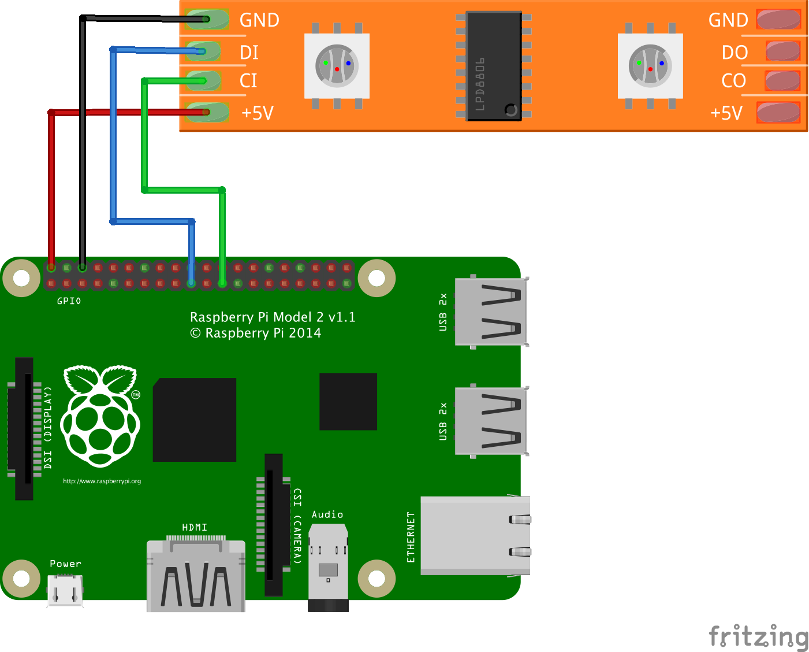

# NodeConf EU 2016 IoT Workshop

## Getting Started

### Prerequisites:

- Install [Node.js](https://nodejs.org/)
- Install [Visual Studio Code](https://code.visualstudio.com/)
- Install the [Windows IoT Core Extension](https://marketplace.visualstudio.com/items?itemName=ms-iot.windowsiot) for Visual Studio Code

### Setting Up the Project:

Start by cloning the project and installing dependencies

```Bash
git clone https://github.com/nebrius/nodeconfeu2016.git
cd nodeconfeu2016
npm install
```

Then, open the project in Visual Studio Code (File->Open and select the `nodeconfeu2016` folder).

Finally, configure the device settings:

- Hit F1 and enter `iot: Initialize settings.json` (it will auto-complete) and hit `Enter`
- Enter the IP address that was provided with your Raspberry Piand hit `Enter`
- Leave the device name blank and hit `Enter`
- Enter the username `Administrator` and hit `Enter`
- Enter the password `raspberry` and hit `Enter`

### Connecting the Hardware:

Connect the hardware as shown in the circuit schematic below:



Be careful to make sure you connect the correct wires to the correct pins on the Raspberry Pi. Failure to connect the wires correctly could damage the hardware! The pins should be connected this way:

| DotStar | Raspberry Pi |
|---------|--------------|
| VCC     | 2 (5V)       |
| GND     | 6 (GND)      |
| DI      | 19 (MOSI0)   |
| CI      | 23 (SCLK0)   |

A complete pinout of the Raspberry Pi can be found [here](https://github.com/nebrius/raspi-io/wiki/Pin-Information).

### Programming the Raspberry Pi:

To run your program, hit F1, enter `iot: Run Remote Script`, and hit `Enter` and Visual Studio Code will upload your program to the Raspberry Pi and run it on the device automatically.

If you run the code as-is, you should see the lights turn on in a rainbow of colors!

To gain insights about your device, such as what apps are running, what the system utilization is, and other things, point your browser to `http://<IP Address of Raspberry Pi>:8080`.

## Builds

Choose one of the two builds below, or do both if you're ambitious! Edit the `init` callback function in [index.js](index.js) with your solution.

### Game Scoreboard

For this build, we will be creating a visual scoreboard. The scoreboard will keep track of points in two player games in the form of a bar graph.

Each player will be represented by a different color and assigned to one side of the DotStar Strip. As players gain points, another dot will light up, starting from their side of the strip and moving toward the center. The first player to get to the center wins!

To control the scoreboard, have the Raspberry Pi host a webpage where you can click on one of two buttons marked "Player 1" and "Player 2" that increments the scoreboard.

**Stretch goals**

- Implement a game, such as tic-tac-toe, inside the browser that automatically controls the scoreboard
- Have the lights flash and change colors when a player wins, like on a slot machine

### Animation Control

For this build, we will be creating an animated light stick that can be controlled remotely.

The lights should animate by fading the colors so that it looks like they are "traveling" along a line, such as [in this video](https://www.youtube.com/watch?v=ZbM1PRn_TQ8).

To fade the color like this, you will want to modify color values in the [HSV color space](https://en.wikipedia.org/wiki/HSL_and_HSV). You may be familiar with the HSV color space from color pickers, which often have the ability to switch between RGB sliders and HSV sliders.

To animate through the colors, set the saturation and value to 100%, and then step through the full 360 degrees of hue to create a smooth color animation. There are a several npm packages for converting between RGB and HSV, such as [hsv-to-rgb](https://www.npmjs.com/package/hsv-rgb) and [rgb-to-hsv](https://www.npmjs.com/package/rgb-hsv).

**Stretch Goals**

- Make the "speed" of the fade and the brightness controllable from a web page
- Create a new animation, such as pulsing colors

## License

Copyright (c) 2016 Bryan Hughes <bryan@nebri.us>

Permission is hereby granted, free of charge, to any person
obtaining a copy of this software and associated documentation
files (the "Software"), to deal in the Software without
restriction, including without limitation the rights to use,
copy, modify, merge, publish, distribute, sublicense, and/or sell
copies of the Software, and to permit persons to whom the
Software is furnished to do so, subject to the following
conditions:

The above copyright notice and this permission notice shall be
included in all copies or substantial portions of the Software.

THE SOFTWARE IS PROVIDED "AS IS", WITHOUT WARRANTY OF ANY KIND,
EXPRESS OR IMPLIED, INCLUDING BUT NOT LIMITED TO THE WARRANTIES
OF MERCHANTABILITY, FITNESS FOR A PARTICULAR PURPOSE AND
NONINFRINGEMENT. IN NO EVENT SHALL THE AUTHORS OR COPYRIGHT
HOLDERS BE LIABLE FOR ANY CLAIM, DAMAGES OR OTHER LIABILITY,
WHETHER IN AN ACTION OF CONTRACT, TORT OR OTHERWISE, ARISING
FROM, OUT OF OR IN CONNECTION WITH THE SOFTWARE OR THE USE OR
OTHER DEALINGS IN THE SOFTWARE.
